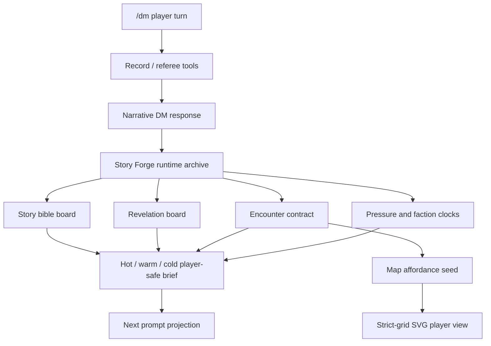

# Story Forge Next Upgrade Plan

This document defines the next upgrade after the production Story Forge runtime
landed. It is a planning document only: do not treat it as an implementation
record until the corresponding code and tests are merged.

## Background

The current Story Forge runtime already provides:

- Three-layer responsibility split: writer layer, narrative DM layer, and record
  / referee layer.
- Per-turn archive infrastructure under `_story_forge_archive`.
- Player-safe `story_forge_player_brief` projection.
- `record_story_forge_convergence` goal cards.
- Player-safe `map_grid_seed` to deterministic strict-grid SVG rendering.
- Hidden-truth guards and DeepSeek v4 flash regression tooling.

The next stage should not simply make the prompt longer or more literary. The
goal is to make the system better at long-form campaign operation: planting and
paying off story material, preserving player agency, making scenes playable, and
keeping token cost predictable.

## Upgrade Principles

1. Structure before prose.

   Better prose is useful, but durable story quality should come from stable
   structures: theme, motif, clue maturity, scene pressure, NPC agenda, clocks,
   map affordances, and explicit failure-forward outcomes.

2. Archive is not prompt.

   Runtime archives may remain rich and auditable. Ordinary DM prompts should
   receive only compact, player-safe, action-relevant state.

3. Player-visible truth first.

   Writer-layer planning can only converge material the players have observed,
   reasonably inferred, or verified through tools. Hidden truth remains in
   referee-only state and never enters goal cards, map seeds, or player briefs.

4. Gameplay must be executable.

   A strong scene is not only a mood or lore beat. It needs available actions,
   cost, risk, pressure, success signals, partial success, failure-forward
   consequences, and a changed world state.

5. Cache stability is a product constraint.

   DeepSeek v4 flash prefix caching is cheap when stable prefixes remain stable.
   Prompt layout and runtime state projection must protect cache hit rate while
   preserving narrative quality.

## Target Architecture

The next architecture keeps the current runtime and adds four higher-level
state boards.



## New Runtime Boards

### 1. Story Bible Board

Purpose: make long campaigns feel intentionally authored without forcing a
railroad.

Proposed scene location:

```json
{
  "story_bible": {
    "schema_version": 1,
    "theme": [],
    "motifs": [],
    "tone_bounds": {},
    "emotional_arc": {},
    "payoff_bank": []
  }
}
```

Fields:

- `theme`: campaign-level thematic statements or questions.
- `motifs`: recurring player-visible images, objects, places, phrases, colors,
  rituals, or sounds.
- `tone_bounds`: safety and style constraints, such as horror intensity,
  comedy level, romance level, and acceptable brutality.
- `emotional_arc`: current emotional position and desired next shift.
- `payoff_bank`: planted material that should eventually return.

Rules:

- The board may store player-visible material and style constraints.
- Hidden truth references must be stored by ID only or kept outside the
  player-safe projection.
- Ordinary prompts should receive a compact version: theme IDs, motif names,
  and only currently relevant payoff candidates.

### 2. Revelation Board

Purpose: track clue maturity so the system knows when to seed, reinforce,
verify, converge, or pay off a thread.

Proposed shape:

```json
{
  "revelation_board": [
    {
      "thread_id": "thread:lighthouse_signal",
      "title": "灯塔信号异常",
      "maturity": "interpreted",
      "visible_evidence": ["clue:blue_wax", "clue:late_tide_log"],
      "player_hypotheses": [],
      "next_best_reveal": "",
      "payoff_ready": false
    }
  ]
}
```

Maturity ladder:

- `seeded`: introduced but not clearly noticed.
- `noticed`: players reacted to it.
- `interpreted`: players formed a hypothesis or chose a direction.
- `verified`: tool result, NPC testimony, map fact, or rule result confirmed it.
- `payoff_ready`: enough visible material exists for a reveal or scene shift.
- `paid_off`: the thread has produced a consequence, reveal, or new situation.

Rules:

- Convergence goal cards should prefer `interpreted`, `verified`, or
  `payoff_ready` threads.
- If several turns pass with no maturity change, the DM should introduce
  pressure, a verification path, or a new affordance rather than adding more
  unrelated lore.
- `paid_off` threads should remain as compact references, not full text.

### 3. Encounter Contract

Purpose: upgrade "next scene goal" into a playable scene contract.

Proposed shape:

```json
{
  "encounter_contract": {
    "schema_version": 1,
    "encounter_id": "enc:lighthouse_lower_gate",
    "encounter_type": "investigation",
    "opening_image": "",
    "win_conditions": [],
    "loss_conditions": [],
    "partial_success": [],
    "available_actions": [],
    "resource_pressure": [],
    "escalation_clock_refs": [],
    "reward_vector": [],
    "exit_states": []
  }
}
```

Encounter types:

- `investigation`
- `social`
- `stealth`
- `chase`
- `combat`
- `travel`
- `puzzle`
- `downtime`

Required gameplay guarantees:

- At least three meaningful available actions unless the scene is intentionally
  constrained.
- At least one cost or risk.
- At least one failure-forward consequence.
- At least one reward vector: information, position, ally, resource, leverage,
  safety, time, or narrative permission.
- Exit states must change the world or available choices.

### 4. Pressure And Faction Clocks

Purpose: make the world move even when players hesitate, rest, miss checks, or
ignore NPCs.

Existing `pressure_clock` support should be formalized and expanded:

```json
{
  "pressure_clocks": [
    {
      "clock_id": "clock:cult_ritual",
      "label": "潮汐仪式",
      "value": 2,
      "max": 6,
      "visible": true,
      "tick_triggers": ["long_rest", "failed_stealth", "ignored_warning"],
      "on_tick": "",
      "on_complete": ""
    }
  ],
  "faction_clocks": [
    {
      "faction_id": "faction:harbor_watch",
      "clock_id": "clock:watch_alert",
      "label": "港口警戒",
      "value": 1,
      "max": 4,
      "visible": "partial",
      "next_move_if_ignored": ""
    }
  ]
}
```

Rules:

- Clock ticks should be caused by concrete player-visible triggers or explicit
  downtime.
- Completion must produce a playable state change, not only narration.
- Hidden faction clocks may exist, but player prompts only receive public or
  partial signals.

## Map Gameplay Upgrade

The current map loop already renders player-safe `map_grid_seed` through SVG.
The next step is to make grid data gameplay-aware.

Add optional cell and entity affordances:

- `cover`
- `difficult_terrain`
- `noise_zone`
- `light_level`
- `interactive`
- `hazard_tick`
- `objective_zone`
- `line_of_sight_hint`
- `entry_exit`

The SVG remains visual-only. Authoritative coordinates, movement, distance,
line of sight, and battle state still belong to map / spatial / turn tools.

Player-view rendering should show affordances conservatively:

- Known doors, exits, visible hazards, and obvious cover may be shown.
- Hidden traps, secret doors, concealed enemies, and unknown objectives must not
  appear in player-view SVG.
- If the writer layer proposes a map seed with hidden fields, the renderer path
  should reject it before generating output.

## Prompt And Token Plan

### Prompt Layering

Formalize prompt composition into four layers:

1. Stable prefix:

   - System duties.
   - Three-layer Story Forge responsibility split.
   - Safety and hidden-truth rules.
   - Output and tool-use contracts.

2. Campaign static:

   - Ruleset summary.
   - Campaign premise.
   - Character roster.
   - Story bible compact view.

3. Session hot state:

   - Current objective.
   - Current encounter contract.
   - active pressure clocks.
   - relevant revelation threads.
   - current map / turn facts.

4. Turn delta:

   - Player message.
   - Latest tool results.
   - immediate route / referee notes.

Stable and low-frequency content must appear before high-frequency deltas to
increase DeepSeek prefix-cache reuse.

### Hot / Warm / Cold Briefs

Replace one flat `story_forge_player_brief` projection with a layered brief:

```json
{
  "story_forge_player_brief": {
    "schema_version": 2,
    "hot": {},
    "warm": {},
    "cold_refs": [],
    "retrieval_hints": []
  }
}
```

Rules:

- `hot`: always included in prompt; only current-scene playable state.
- `warm`: included within token budget; current chapter, active NPCs, relevant
  clocks, and near-payoff threads.
- `cold_refs`: IDs and titles only.
- `retrieval_hints`: terms that can trigger expansion if the player mentions
  them.

### Tool Result Delta Mode

Add optional return modes for high-volume tools:

- `delta`: only changed fields.
- `summary`: compact state summary.
- `full`: explicit diagnostic or audit mode.

Default DM loop should prefer `delta` or `summary`; diagnostics and regression
tools can request `full`.

### Cache Metrics

Promote cache metrics from regression-only evidence to acceptance gates.

Track:

- `prompt_cache_hit_tokens`
- `prompt_cache_miss_tokens`
- `cache_hit_ratio`
- `prompt_component_chars`
- `prompt_component_tokens`
- `rough_total_tokens`

Initial target gates:

- No drop in hidden-truth safety.
- No drop in playability score.
- No drop in narrative momentum score.
- Regular story regression cache hit ratio >= 55%.
- Long-suite cache hit ratio >= 65%.
- Projected prompt size down 20% to 30% versus current production baseline.

## Implementation Phases

### Phase 1: Planning Boards, No Behavior Change

Deliverables:

- Define dataclasses / normalizers for `story_bible`, `revelation_board`,
  `encounter_contract`, `pressure_clocks`, and `faction_clocks`.
- Add projection tests proving hidden fields stay out of player prompts.
- Add migration-safe defaults for existing sessions.
- Add diagnostic readout for board sizes and token contribution.

Acceptance:

- Existing full test suite passes.
- Existing DeepSeek lighthouse regression remains pass.
- No new board is required for old saves.
- Hidden-truth rejection tests cover all new boards.

### Phase 2: Writer-Layer Scene Contract

Deliverables:

- Extend `record_story_forge_convergence` or add a sibling tool that records
  `encounter_contract`.
- Require available actions, costs, reward vectors, and exit states.
- Connect revelation maturity to goal-card selection.
- Add regression cases for investigation, social, stealth, and combat scenes.

Acceptance:

- At least 4 encounter types pass DeepSeek playability judge.
- Generated scene contracts always include failure-forward consequences.
- Player-facing output exposes choices without railroading.

### Phase 3: Clock Runtime

Deliverables:

- Deterministic clock tick tool.
- Clock projection for public / partial / hidden visibility.
- DM prompt rule: use clock ticks to make delay and failure matter.
- Tests for public clocks, hidden clocks, and partial clock projection.

Acceptance:

- Failed checks and delay can advance clocks without ending the scene.
- Clock completion creates a concrete changed state.
- Hidden clocks never leak true plans or hidden locations.

### Phase 4: Gameplay-Aware Grid Seeds

Deliverables:

- Add affordance schema to map seeds.
- Add renderer support for visible affordance icons / labels.
- Reject hidden affordances in player-view seeds.
- Add map tool tests for cover, hazards, exits, and objective zones.

Acceptance:

- SVG renders remain deterministic.
- Player-view maps show only visible affordances.
- Map facts remain authoritative outside SVG.

### Phase 5: Prompt Budget And Cache Rewrite

Deliverables:

- Split prompt components into stable / static / hot / delta ordering.
- Implement hot / warm / cold Story Forge brief.
- Add tool-result delta mode for high-volume runtime tools.
- Add regression reports with component-level token attribution.

Acceptance:

- Cache hit ratio meets target gates.
- Prompt size drops without quality-score regression.
- Story Forge archive remains complete while prompt projection stays compact.

## Regression Matrix

Minimum scenario suite:

| Scenario | Primary Risk | Required Checks |
|:--|:--|:--|
| Lighthouse investigation | hidden truth leakage | revelation maturity, failure-forward, map seed safety |
| Court intrigue | NPC agenda drift | faction clocks, social encounter contract |
| Cyberpunk extraction | player agency | stealth / chase actions, pressure clocks |
| Wasteland convoy | resource pressure | travel encounter, hazard map affordances |
| Xianxia sect trial | tone and payoff | motifs, theme, partial success, public clocks |
| Combat breach | map gameplay | cover, objective zones, line-of-sight-safe rendering |

## Operational Rollout

1. Ship planning boards behind config defaults.
2. Run local unit tests and compileall.
3. Run lighthouse DeepSeek regression.
4. Run multigenre DeepSeek regression.
5. Enable on NAS with logging only.
6. Observe real `/dm` logs for:

   - board growth;
   - prompt component size;
   - cache hit ratio;
   - convergence card count;
   - hidden-field rejections;
   - map render success / failure;
   - user-visible dead ends or railroading.

7. Only then allow writer-layer behavior to actively use new boards.

## Open Questions

- Should `story_bible` be campaign-global, session-local, or both?
- Should `encounter_contract` replace convergence cards or become a nested
  extension?
- Which provider usage payloads expose enough cache data in production AstrBot
  logs, not just DeepSeek test scripts?
- How aggressive should warm/cold brief pruning be before it hurts continuity?
- Do we need a user-facing command to export the archived campaign as a readable
  session record?

## Non-Goals For This Upgrade

- No automatic full-plot railroading.
- No hidden-truth exposure in player-facing planning fields.
- No SVG-as-authority map state.
- No every-turn heavy judge call in production runtime.
- No replacement of referee tools with prose-only narration.
